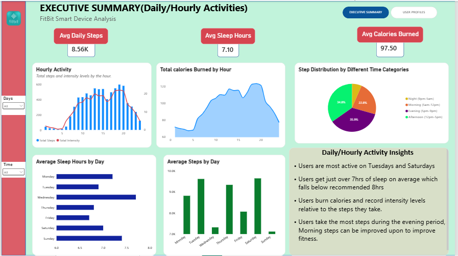
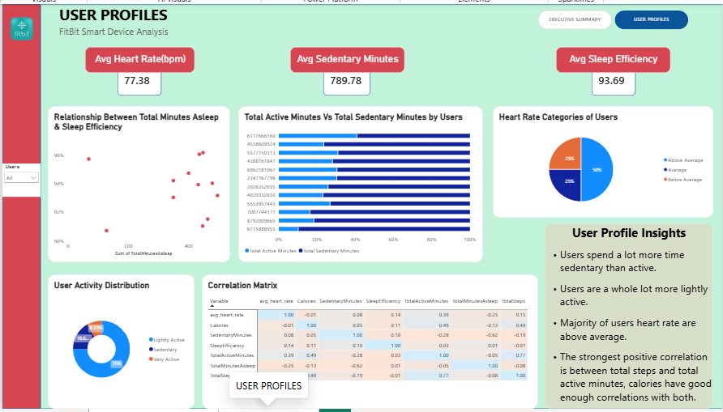

# Bellabeat Marketing Analysis: Smart Device Usage Insights

## 📌 Overview
Bellabeat is a high-tech wellness company focused on women's health. 
This project analyzes FitBit's public smart device fitness data to uncover 
usage trends and translate them into actionable marketing recommendations 
for the Bellabeat executive team.

## 🎯 Business Task
Analyze how consumers use non-Bellabeat smart devices to inform 
Bellabeat's marketing strategy. The goal is to translate these behavioral trends into actionable marketing recommendations for the BellaBeat App and broader BellaBeat"s ecosystem

## 🛠️ Tools Used
- **Python** (pandas, numpy) — data cleaning, Processing & EDA
- **Jupyter Lab** — analysis workflow
- **Power BI** — interactive dashboard

## 📂 Project Deliverables
| File | Description |
|------|-------------|
| [📓 Full Analysis Notebook](./Bellabeat-Notebook.ipynb) | Complete Python code, cleaning steps, analysis, insights and recommendations. |
| [📊 Power BI Dashboard](./FitBit-Dashboard.pbix) | Interactive dashboard visualizing key trends |
## 🖼️ Dashboard Preview

A quick look at the final Power BI dashboard. Open the full dashboard file for interactivity.

### Executive Summary

### User Profiles

## 🔍 Key Insights
1. **[Insight 1]** — e.g., "Users are most active on Tuesdays and Saturdays"
2. **[Insight 2]** — e.g., "Sedentary behavior averages 13+ hours/day"
3. **[Insight 3]** — e.g., "Majority of users heart rate are above average"

## 💡 Recommendations
1. **[Recommendation 1]** — Reposition the Bellabeat App as a "Recovery & Micro-Habit Coach" 
2. **[Recommendation 2]** — Launch a "Desktop Detox" Campaign
3. **[Recommendation 3]** - Introduce a "Weekly Sleep Consistency" Campaign
4. **[Recommendation 4]** - Capitalize on the Evening Activity Peak
5. **[Recommendation 5]** -  Use Heart Rate Data to Promote Holistic Health Tracking 
## 📖 How to Navigate
Start with this README for the summary. For the technical deep-dive, 
open the [notebook](./Bellabeat-Notebook.ipynb). For the business-facing 
output, view the dashboard file and images above.
